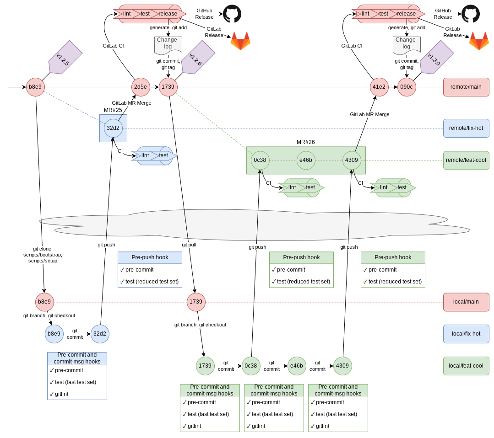

<!-- omit in toc -->
# Repository Template


[](https://github.com/pre-commit/pre-commit)
[](https://conventionalcommits.org)
[](https://github.com/semantic-release/semantic-release)


[](https://gitlab.com/xebis/repository-template/-/commits/main)

Template for highly automated, up-to-date, and well-documented repositories.

Covers documentation and license templates, check numerous common problems, Markdown, YAML, Bash, and run tests - all of it before commit, push, and at CI. Releases to GitLab and GitHub using semantic versioning and generating changelog.

**The project is under active development.**

<!-- omit in toc -->
## The Purpose

The purpose is to have a template repository and to have it *well-manageable* and *well-maintainable* by both human beings and automation tools.

The rationale behind this is that taking care of tens or hundreds of repositories while keeping them working, tidy, consistent, and up-to-date, might be a daunting task.

The way how to achieve the desired state of manageability and maintainability is to *unify* and *automate* workflow to allow frequent small changes for multiple projects at scale.

Objectives:

- Simple and easy environment check and setup
- Fast and unified code change contribution
- Automated and reliable code change propagation (build, testing, integration, publication or deployment, and release)

Strategies and tactics to achieve objectives:

1. Automate
2. Automate
3. Automate

<!-- omit in toc -->
## Table of Contents

- [Features](#features)
  - [Templates](#templates)
  - [Images](#images)
- [Installation and Configuration](#installation-and-configuration)
  - [Local Environment](#local-environment)
  - [GitLab Project](#gitlab-project)
- [Usage](#usage)
  - [Usage Examples](#usage-examples)
- [Contributing](#contributing)
  - [Testing](#testing)
    - [Test at Docker Alpine Container](#test-at-docker-alpine-container)
    - [Test GitLab CI Locally](#test-gitlab-ci-locally)
- [To-Do list](#to-do-list)
- [Roadmap](#roadmap)
- [Credits and Acknowledgments](#credits-and-acknowledgments)
- [Copyright and Licensing](#copyright-and-licensing)
- [Changelog and News](#changelog-and-news)
- [Notes and References](#notes-and-references)
  - [Dependencies](#dependencies)
  - [Recommendations](#recommendations)
  - [Suggestions](#suggestions)
  - [Further Reading](#further-reading)

## Features

Optimized for [GitHub flow](https://guides.github.com/introduction/flow/), easily adjustable to [GitLab flow](https://docs.gitlab.com/ee/topics/gitlab_flow.html) or any other workflow.



- Automated workflow using [git hooks](https://git-scm.com/book/en/v2/Customizing-Git-Git-Hooks), and [GitLab CI](https://about.gitlab.com/stages-devops-lifecycle/continuous-integration/)
  - GitLab CI skips CI if commit message contains `[ci skip]` or `[skip ci]`, using any capitalization, or pass **git push option** `ci.skip` (`git push -o ci.skip` git >= 2.17, `git push --push-option=ci.skip` git >= 2.10)
- Commit messages are checked using [gitlint](https://github.com/jorisroovers/gitlint) and [Conventional Commits](https://www.conventionalcommits.org/en/v1.0.0/)
- Git `commit` is normalized, checked, and tested:
  - Runs quick test set
- Git `push` is checked, and tested:
  - Lints last commit message
  - Prevents `todo` preceded with `#` at the codebase
  - Prevents existence of unstaged files
  - Runs reduced test set
  - Merge request could by created with **git push options**, see <https://docs.gitlab.com/ee/user/project/push_options.html#push-options-for-merge-requests>
- GitLab CI run is checked, and tested:
  - Lints last commit message (except `release` commits)
  - Prevents `todo` preceded with `#` at the codebase
  - Runs full test set on non-scheduled pipeline runs
  - Runs nightly test set on scheduled pipeline runs
- Git `commit` scans each codebase change; git `push`, and GitLab CI scans the whole codebase, and the following rules are applied:
  - Enforces max file size to 1024 kB using [pre-commit/pre-commit-hooks: check-added-large-files](https://github.com/pre-commit/pre-commit-hooks#check-added-large-files)
  - Prevents case insensitive filename conflict using [pre-commit/pre-commit-hooks: check-case-conflict](https://github.com/pre-commit/pre-commit-hooks#check-case-conflict)
  - Enforces executables have shebangs using [pre-commit/pre-commit-hooks: check-executables-have-shebangs](https://github.com/pre-commit/pre-commit-hooks#check-executables-have-shebangs)
  - Prevents merge conflict strings using [pre-commit/pre-commit-hooks: check-merge-conflict](https://github.com/pre-commit/pre-commit-hooks#check-merge-conflict)
  - Prevents stale symlinks using [pre-commit/pre-commit-hooks: check-symlinks](https://github.com/pre-commit/pre-commit-hooks#check-symlinks)
  - Prevents non-permanent GitHub links using [pre-commit/pre-commit-hooks: check-vcs-permalinks](https://github.com/pre-commit/pre-commit-hooks#check-vcs-permalinks)
  - Prevents destroyed symlinks using [pre-commit/pre-commit-hooks: destroyed-symlinks](https://github.com/pre-commit/pre-commit-hooks#destroyed-symlinks)
  - Prevents the existence of private keys using [pre-commit/pre-commit-hooks: detect-private-key](https://github.com/pre-commit/pre-commit-hooks#detect-private-key)
  - Enforces files end with empty newline using [pre-commit/pre-commit-hooks: end-of-file-fixer](https://github.com/pre-commit/pre-commit-hooks#end-of-file-fixer)
  - Prevents UTF8 byte order marker using [pre-commit/pre-commit-hooks: fix-byte-order-marker](https://github.com/pre-commit/pre-commit-hooks#fix-byte-order-marker)
  - Prevents new git submodules [pre-commit/pre-commit-hooks: forbid-new-submodules](https://github.com/pre-commit/pre-commit-hooks#forbid-new-submodules)
  - Converts line endings to LF using [pre-commit/pre-commit-hooks: mixed-line-ending](https://github.com/pre-commit/pre-commit-hooks#mixed-line-ending)
  - Prevents commits to protected branches using [pre-commit/pre-commit-hooks: no-commit-to-branch](https://github.com/pre-commit/pre-commit-hooks#no-commit-to-branch)
  - Prevents trailing whitespaces using [pre-commit/pre-commit-hooks: trailing-whitespace](https://github.com/pre-commit/pre-commit-hooks#trailing-whitespace)
  - Prevents botched name/email translations in git history using [jumanjihouse/pre-commit-hooks: check-mailmap](https://github.com/jumanjihouse/pre-commit-hooks#check-mailmap)
  - Prevents binary files from being added by accident using [jumanjihouse/pre-commit-hooks: forbid-binary](https://github.com/jumanjihouse/pre-commit-hooks#forbid-binary)
  - Enforces executable scripts have no extension using [jumanjihouse/pre-commit-hooks: script-must-not-have-extension](https://github.com/jumanjihouse/pre-commit-hooks#script-must-not-have-extension)
  - Enforces non-executable script libraries have extension using [jumanjihouse/pre-commit-hooks: script-must-have-extension](https://github.com/jumanjihouse/pre-commit-hooks#script-must-have-extension)
  - Lints Markdown using [igorshubovych/markdownlint-cli: MarkdownLint Command Line Interface](https://github.com/igorshubovych/markdownlint-cli) (except [CHANGELOG.md](CHANGELOG.md))
  - Lints YAML using [adrienverge/yamllint](https://github.com/adrienverge/yamllint)
  - Lints [`.gitlab-ci.yml`](.gitlab-ci.yml) file using [devopshq/gitlab-ci-linter](https://gitlab.com/devopshq/gitlab-ci-linter) when `GL_TOKEN` environment variable is set to **GitLab Personal Token**
  - Lints shell scripts formatting using [mvdan/sh: A shell parser, formatter, and interpreter with bash support; includes shfmt](https://github.com/mvdan/sh)
  - Checks shell scripts using [koalaman/shellcheck: ShellCheck, a static analysis tool for shell scripts](https://github.com/koalaman/shellcheck)
  - For other formats and rules see [pre-commit: Supported hooks](https://pre-commit.com/hooks.html), there are many for .NET, Ansible, AWS, C, CMake, CSV, C++, Chef, Dart, Docker, Flutter, git, GitHub, GitLab, Go, HTML, INI, Java, JavaScript, Jenkins, Jinja, JSON, Kotlin, Lisp, Lua, Mac, Markdown, Node.js, Perl, PHP, Prometheus, Protobufs, Puppet, Python, R, Ruby, Rust, Shell, Swift, Terraform, TOML, Typescript, XML, YAML, ... or create new using regular expressions.
- When merged to `main` branch releases using [semantic-release/semantic-release](https://github.com/semantic-release/semantic-release)
  - Determines major, minor, or patch version bump using [semantic-release/commit-analyzer](https://github.com/semantic-release/commit-analyzer)
  - Generates release notes using [semantic-release/release-notes-generator](https://github.com/semantic-release/release-notes-generator)
  - Generates changelog using [semantic-release/changelog](https://github.com/semantic-release/changelog)
  - Commits changelog and new version using [semantic-release/git](https://github.com/semantic-release/git)
  - Releases new version by tagging using [semantic-release/gitlab](https://github.com/semantic-release/gitlab)
  - Releases new version by tagging using [semantic-release/github](https://github.com/semantic-release/github)
  - Semantic-release skips release if commit contains `[skip release]` or `[release skip]` in the commit message
- `tools/setup-repo` script checks environment, installs dependencies, and setup hooks
- `tools/secrets` script to source secrets
- `tools/update-repo` script updates used dependencies

### Templates

Templates for your convenience.

- [Readme Template](templates/README.md)
- Licenses
  - [MIT License Template](templates/MIT-LICENSE)
  - [NO License Template](templates/NO-LICENSE)

### Images

- [Git workflow examples & template](images/workflow.drawio)
- [Example of the full workflow](images/workflow-full.png)
- [Example of a feature workflow](images/workflow-feature.png)
- [Example of a bugfix workflow](images/workflow-fix.png)

## Installation and Configuration

### Local Environment

Clone the project with `--recursive` option, run `tools/setup-repo`, and adjust to Your needs. Make sure **GL_TOKEN**: [GitLab Personal Access Token](https://gitlab.com/-/profile/personal_access_tokens) with scope `api` present, otherwise `gitlab-ci-linter` is skipped. You can edit and source `tools/secrets.sh` script, **please make sure you won't commit your secrets** perhaps by running `git update-index --skip-worktree tools/secrets.sh`.

Example:

```shell
git clone --recursive git@gitlab.com:xebis/repository-template.git
cd repository-template
tools/setup-repo
# Add your secrets to tools/secrets.sh
. tools/secrets.sh
```

### GitLab Project

Set up release and GitLab CI Linter tokens as the GitLab group or the GitLab project variable:

- **GL_TOKEN**: [GitLab Personal Access Token](https://gitlab.com/-/profile/personal_access_tokens) with scopes `api` and `write_repository`. Shouldn't be protected otherwise GitLab CI job `lint` fails with an error `Server said HTTP Error 401: Unauthorized: https://gitlab.com/api/v4/ci/lint`.
- **GH_TOKEN**: [GitHub Personal Access Token](https://docs.github.com/en/github/authenticating-to-github/about-authentication-to-github#authenticating-with-the-api) with at least scopes `repo` for a private repository or `public_repo` for a public repository. Should be protected.

- Settings
  - CI/CD
    - Variables, *Expand*
      - *Add Variable*:
        - Key: `GL_TOKEN` or `GH_TOKEN`
        - Value: *token*
        - Flags:
          - Protect variable: **On**

Set up the GitLab scheduled pipeline:

- CI/CD
  - Schedules
    - *New schedule*
      - *Fill* and *Save pipeline schedule*

Run `tools/update-repo` from time to time to update repository dependencies.

## Usage

Simply fork the repository at [GitLab](https://gitlab.com/xebis/repository-template/-/forks/new) or [GitHub](https://github.com/xebis/repository-template/fork), **delete** all git tags, and **tag** the last commit to a desired starting version, e.g. `v0.0.0`. Clone the repository with `--recursive` option, run `tools/setup-repo`, and enjoy!

- `git commit` runs checks on changed files and performs tests a quick test set
- `git push` runs checks on all files and performs tests with a reduced test set
- GitLab `push`, `merge request` runs checks on all files and performs tests with a full test set
- GitLab `merge to main` runs checks on all files and performs tests with a full test set
- GitLab `schedule` runs checks on all files, performs tests with a nightly test set, and releases a new version
- Run `tools/update-repo` manually from time to time

### Usage Examples

For usage examples you might take a look at:

- [GitHub - xebis/infrastructure-template: Template for automated GitOps and IaC in a cloud. GitLab CI handles static and dynamic environments. Environments are created, updated, and destroyed by Terraform, then configured by cloud-init and Ansible.](https://github.com/xebis/infrastructure-template) - example of GitOps (IaC + MRs + CI/CD) and multiple environments orchestration
- [GitHub - xebis/shellib: Simple Bash scripting library.](https://github.com/xebis/shellib) - example of version bumping and packaging

## Contributing

Please read [CONTRIBUTING](CONTRIBUTING.md) for details on our code of conduct, and the process for submitting merge requests to us.

### Testing

- Git hooks check a lot of things for you (see [Features](#features))
- Run automated tests `bats tests`
- Make sure all `tools/*` scripts, git hooks and GitLab pipelines work as expected, testing checklist:

- `tools/*` scripts
  - [ ] [`tools/check-sanity`](tools/check-sanity)
  - [ ] [`tools/commit-msg`](tools/commit-msg)
  - [ ] [`tools/secrets.sh`](tools/secrets.sh)
  - [ ] [`tools/pre-commit`](tools/pre-commit)
  - [ ] [`tools/pre-push`](tools/pre-push)
  - [ ] [`tools/setup-repo`](tools/setup-repo)
  - [ ] [`tools/update-repo`](tools/update-repo)
- Local working directory
  - [ ] `git commit` runs [`tools/commit-msg`](tools/commit-msg) and [`tools/pre-commit`](tools/pre-commit)
  - [ ] `git push` runs [`tools/pre-push`](tools/pre-push)
- GitLab CI
  - [ ] Commit in _non_-`main` branch runs `validate:lint` and `validate:test-full`
  - [ ] Merge to `main` branch runs `validate:lint`, `validate:test-full`, and `release:release`
    - [ ] With a new `feat` or `fix` commit releases a new version
    - [ ] Without a new feature or fix commit does not release a new version
  - [ ] Scheduled (nightly) pipeline runs `validate:lint` and `validate:test-nightly`

#### Test at Docker Alpine Container

- Run docker container:

```bash
sudo docker run -it --rm -v "$(pwd)":/repository-template alpine:latest # Create disposal docker container
```

- In the container:

```bash
cd repository-template
# Set variables GL_TOKEN and GH_TOKEN when needed
# Put here commands from .gitlab-ci.yml job:before_script and job:script
# For example job test-full:
apk -U upgrade
apk add bats
bats tests
# Result is similar to:
# 1..1
# ok 1 dummy test
```

#### Test GitLab CI Locally

There is not a simple way how to test GitLab CI locally, you might try:

- Install GitLab Runner

```bash
curl -L https://packages.gitlab.com/install/repositories/runner/gitlab-runner/script.deb.sh | sudo bash
export GITLAB_RUNNER_DISABLE_SKEL=true
sudo -E apt-get install gitlab-runner
```

- Hack `.gitlab-ci.yml` for *local run*: Copy [`.gitlab-ci.yml`](.gitlab-ci.yml) section `default.before_script` contents as first lines of `job.script` section
- Run GitLab Runner Locally

```bash
gitlab-runner exec shell job
# OR
sudo gitlab-runner exec docker job --docker-image alpine:latest
```

## To-Do list

- [ ] Fix workaround for pre-commit `jumanjihouse/pre-commit-hooks` hook `script-must-have-extension` - `*.bats` shouldn't be excluded

## Roadmap

- [ ] Speed up CI/CD with a set of Docker images with pre-installed dependencies for each CI/CD stage

## Credits and Acknowledgments

- [Martin Bružina](https://bruzina.cz/) - Author

## Copyright and Licensing

- [MIT License](LICENSE)
- Copyright © 2021 Martin Bružina

## Changelog and News

- [Changelog](CHANGELOG.md)

## Notes and References

### Dependencies

- [git](https://git-scm.com/)
- [GitLab: The complete DevOps platform](https://about.gitlab.com/)
  - [GitLab: Continuous Integration (CI) with GitLab](https://about.gitlab.com/stages-devops-lifecycle/continuous-integration/)
  - [GitLab: GitLab Runner](https://docs.gitlab.com/runner/)
- [Docker Hub - Alpine](https://hub.docker.com/_/alpine)
- [Docker Hub - Node](https://hub.docker.com/_/node)
- [GitHub - semantic-release/semantic-release: Fully automated version management and package publishing](https://github.com/semantic-release/semantic-release)
- [pre-commit: A framework for managing and maintaining multi-language pre-commit hooks](https://pre-commit.com/)
  - [pre-commit: Supported hooks](https://pre-commit.com/hooks.html)
- [GitHub - pre-commit/pre-commit-hooks: Some out-of-the-box hooks for pre-commit](https://github.com/pre-commit/pre-commit-hooks)
- [GitHub - jumanjihouse/pre-commit-hooks: git pre-commit hooks that work with http://pre-commit.com/](https://github.com/jumanjihouse/pre-commit-hooks)
- [GitHub - jorisroovers/gitlint: Linting for your git commit messages](https://github.com/jorisroovers/gitlint)
- [GitHub - igorshubovych/markdownlint-cli: MarkdownLint Command Line Interface](https://github.com/igorshubovych/markdownlint-cli)
- [GitHub - adrienverge/yamllint: A linter for YAML files.](https://github.com/adrienverge/yamllint)
- [GitLab - devopshq/gitlab-ci-linter](https://gitlab.com/devopshq/gitlab-ci-linter)
- [GitHub - mvdan/sh: A shell parser, formatter, and interpreter with bash support; includes shfmt](https://github.com/mvdan/sh)
- [GitHub - koalaman/shellcheck: ShellCheck, a static analysis tool for shell scripts](https://github.com/koalaman/shellcheck)
- [GitHub - bats-core/bats-core: Bash Automated Testing System](https://github.com/bats-core/bats-core)
  - [GitHub - bats-core/bats-support: Supporting library for Bats test helpers](https://github.com/bats-core/bats-support)
  - [GitHub - bats-core/bats-assert: Common assertions for Bats](https://github.com/bats-core/bats-assert)
  - [GitHub - bats-core/bats-file: Common filesystem assertions for Bats](https://github.com/bats-core/bats-file)

### Recommendations

- [Commitizen](https://commitizen-tools.github.io/commitizen/)
- [readme.so: Easiest Way to Create A README](https://readme.so/)
- [GitHub - matiassingers/awesome-readme: A curated list of awesome READMEs](https://github.com/matiassingers/awesome-readme)
- [Grammarly](https://www.grammarly.com/) or [Hemingway Editor](http://www.hemingwayapp.com/)

### Suggestions

- [Shields.io: Quality metadata badges for open source projects](https://shields.io/)
- [Visual Studio Code](https://code.visualstudio.com/) with [Extensions for Visual Studio Code](https://marketplace.visualstudio.com/VSCode):
  - [Gremlins tracker for Visual Studio Code](https://marketplace.visualstudio.com/items?itemName=nhoizey.gremlins)
  - English, and grammar:
    - [Code Spell Checker](https://marketplace.visualstudio.com/items?itemName=streetsidesoftware.code-spell-checker)
    - [Grammarly (unofficial)](https://marketplace.visualstudio.com/items?itemName=znck.grammarly)
  - Git, and GitLab:
    - [Git Extension Pack (GPack)](https://marketplace.visualstudio.com/items?itemName=SeyyedKhandon.gpack) - contains Git History, GitLens, Git Graph, Git File History, Conventional Commits, and Checkpoints
    - [gitignore](https://marketplace.visualstudio.com/items?itemName=codezombiech.gitignore)
    - [GitLab Workflow](https://marketplace.visualstudio.com/items?itemName=GitLab.gitlab-workflow)
  - Markdown:
    - [Markdown All in One](https://marketplace.visualstudio.com/items?itemName=yzhang.markdown-all-in-one) - contains Github Markdown Preview, Markdown Checkboxes, Markdown Emoji, Markdown PDF, and markdownlint
    - [Paste Image](https://marketplace.visualstudio.com/items?itemName=mushan.vscode-paste-image)
    - [Markdown yaml Preamble](https://marketplace.visualstudio.com/items?itemName=bierner.markdown-yaml-preamble)
    - [HTTP/s and relative link checker](https://marketplace.visualstudio.com/items?itemName=blackmist.LinkCheckMD)
  - Bash or shell:
    - [Bash IDE](https://marketplace.visualstudio.com/items?itemName=mads-hartmann.bash-ide-vscode)
    - [Bash Beautify](https://marketplace.visualstudio.com/items?itemName=shakram02.bash-beautify)
    - [ShellCheck](https://marketplace.visualstudio.com/items?itemName=timonwong.shellcheck)
    - [shell-format](https://marketplace.visualstudio.com/items?itemName=foxundermoon.shell-format)
    - [Bats (Bash Automated Testing System)](https://marketplace.visualstudio.com/items?itemName=jetmartin.bats)
  - [GitHub - codespell-project/codespell: check code for common misspellings](https://github.com/codespell-project/codespell)

### Further Reading

- [Git - Git Hooks](https://git-scm.com/book/en/v2/Customizing-Git-Git-Hooks)
- [Conventional Commits - Conventional Commits 1.0.0](https://www.conventionalcommits.org/en/v1.0.0/)
- [Semantic Versioning - Semantic Versioning 2.0.0](https://semver.org/)
- [Wikipedia: README](https://en.wikipedia.org/wiki/README)
- [Wikipedia: Contributing guidelines](https://en.wikipedia.org/wiki/Contributing_guidelines)
- [Wikipedia: Code of conduct](https://en.wikipedia.org/wiki/Code_of_conduct)
- [Make a README: Because no one can read your mind (yet)](https://www.makeareadme.com/)
- [Contributor Covenant: A Code of Conduct for Open Source Communities](https://www.contributor-covenant.org/)
- [GitHub - PurpleBooth/a-good-readme-template: A template to make good README.md](https://github.com/PurpleBooth/a-good-readme-template)
- [Programster's Blog: Git Workflows](https://blog.programster.org/git-workflows)
  - [GitHub Guides: Understanding the GitHub flow](https://guides.github.com/introduction/flow/)
  - [GitLab Docs: Introduction to GitLab Flow](https://docs.gitlab.com/ee/topics/gitlab_flow.html)
