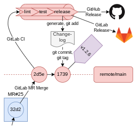

<!-- omit in toc -->
# Repository Template

<!-- cSpell:ignore jumanjihouse, igorshubovych, adrienverge, devopshq, mvdan, koalaman, shellcheckrc, jorisroovers, worktree, matiassingers, Grammarly, romversioning, romver, Programster's, FiraCode -->


[](https://github.com/pre-commit/pre-commit)
[](https://conventionalcommits.org)
[](https://github.com/semantic-release/semantic-release)


[](https://gitlab.com/xebis/repository-template/-/commits/main)
[](https://gitlab.com/xebis/repository-template/-/releases)

Highly automated, up-to-date, and well-documented repository template.

Checks for common problems, Markdown, YAML, Bash, formats, lints, and tests before committing or pushing so you don't have any surprises at CI or when releasing your code to GitLab and GitHub!

**The project is under active development.**

<!-- omit in toc -->
## The Purpose

The purpose is to have a template repository and to have it _well-manageable_ and _well-maintainable_ by both human beings and automation tools.

The rationale behind this is that taking care of tens or hundreds of repositories while keeping them working, tidy, consistent, and up-to-date, might be a daunting task.

The way how to achieve the desired state of manageability and maintainability is to _unify_ and _automate_ workflow to allow frequent small changes for multiple projects at scale.

Objectives:

- Simple and easy environment check and setup
- Fast and unified code change contribution
- Automated and reliable code change propagation (build, testing, integration, publication or deployment, and release)

Strategies and tactics to achieve objectives:

1. Automate
2. Automate
3. Automate

<!-- omit in toc -->
## Table of Contents

- [Features](#features)
  - [Releases](#releases)
  - [Hooks](#hooks)
  - [Tests](#tests)
    - [Test Set](#test-set)
  - [Templates](#templates)
  - [Images](#images)
- [Installation and Configuration](#installation-and-configuration)
  - [Local Environment](#local-environment)
  - [GitLab Project](#gitlab-project)
    - [GitLab - GitHub Synchronization](#gitlab---github-synchronization)
    - [GitLab CI Settings](#gitlab-ci-settings)
    - [GitLab CI Nightly Pipeline](#gitlab-ci-nightly-pipeline)
- [Usage](#usage)
  - [Usage Examples](#usage-examples)
- [Contributing](#contributing)
  - [Testing](#testing)
    - [Test at Docker Container](#test-at-docker-container)
- [To-Do list](#to-do-list)
- [Roadmap](#roadmap)
- [Credits and Acknowledgments](#credits-and-acknowledgments)
- [Copyright and Licensing](#copyright-and-licensing)
- [Changelog and News](#changelog-and-news)
- [Notes and References](#notes-and-references)
  - [Dependencies](#dependencies)
  - [Recommendations](#recommendations)
  - [Suggestions](#suggestions)
  - [Further Reading](#further-reading)

## Features

Optimized for [GitHub flow](https://guides.github.com/introduction/flow/), easily adjustable to [GitLab flow](https://docs.gitlab.com/ee/topics/gitlab_flow.html) or any other workflow.


- Automated workflow using [git hooks](https://git-scm.com/book/en/v2/Customizing-Git-Git-Hooks), and [GitLab CI](https://about.gitlab.com/stages-devops-lifecycle/continuous-integration/)
- Git `commit` scans committed codebase change, git `push` scans pushed codebase change, and GitLab CI scans the whole codebase, and the [hooks](#hooks) are applied
  - Commit messages are checked using [gitlint](https://github.com/jorisroovers/gitlint), commit message should follow [Conventional Commits](https://www.conventionalcommits.org/en/v1.0.0/)
- Git `commit` (both regular and merge) is normalized, checked, and tested:
  - Runs [hooks](#hooks)
  - Runs [fast test set](tests/fast.set)
  - Lints the commit message
- Git `push` is checked, and tested:
  - Runs [hooks](#hooks)
  - Runs [reduced test set](tests/reduced.set)
  - Create merge request directly by **git push options**, see <https://docs.gitlab.com/ee/user/project/push_options.html#push-options-for-merge-requests>
- GitLab CI run is checked, and tested:
  - Lints the latest commit message (except `release` commits)
  - Runs [hooks](#hooks)
  - Runs [full test set](tests/full.set) on non-scheduled pipeline runs
  - Runs [nightly test set](tests/nightly.set) on scheduled pipeline runs
  - Skip GitLab CI run if commit message contains `[ci skip]` or `[skip ci]`, using any capitalization, or pass **git push option** `ci.skip` (`git push -o ci.skip` git >= 2.17, `git push --push-option=ci.skip` git >= 2.10)
- Hooks could be skipped by setting `SKIP` variable to a comma-separated list of skipped hooks, for example, `SKIP=forbid-new-submodules,gitlab-ci-linter git commit`
- Hooks could be run manually `pre-commit run -a --hook-stage manual`
- When `feat` or `fix` commit is present, GitLab CI job `release` publishes release using [semantic-release/semantic-release](https://github.com/semantic-release/semantic-release)
  - When merged to the maintenance release branch (`N.N.x` or `N.x.x` or `N.x` with `N` being a number), publish maintenance [release](#releases)
  - When merged to `next`, `next-major`, `beta`, or `alpha` branch, publish pre-release [release](#releases)
  - When merged to the `main` branch publish [release](#releases)
- Included scripts for your convenience in a fashion of [The GitHub Blog: Scripts to Rule Them All](https://github.blog/2015-06-30-scripts-to-rule-them-all/)
  - `scripts/setup` setups `commit-msg`, `pre-commit`, `pre-merge-commit`, and `pre-push` hooks
  - `scripts/bootstrap` installs dependencies
  - `scripts/test` runs tests, as arguments accepts test files or test sets (see `*.bats` or `*.set` files at the [tests](tests) directory)
  - `scripts/update` updates used dependencies
- [EditorConfig](.editorconfig)

### Releases



Release branches must match regex `^(((0|[1-9]\d*)\.)(((0|[1-9]\d*|x)\.)?x)|main|next(-major)?|beta|alpha)$`, see <https://regex101.com/r/gH9dCG/2/>.

When `feat` or `fix` commit is present in the merge (to be more precise since the last release tag) to `main`, `next`, `next-major`, `beta`, `alpha`, _`major`_`.x`, or _`major.minor`_`.x` branch, the publish release:

- Determines major, minor, or patch version bump using [semantic-release/commit-analyzer](https://github.com/semantic-release/commit-analyzer)
- Generates release notes using [semantic-release/release-notes-generator](https://github.com/semantic-release/release-notes-generator)
- Generates changelog using [semantic-release/changelog](https://github.com/semantic-release/changelog)
- Commits changelog and new version using [semantic-release/git](https://github.com/semantic-release/git)
- Publishes new version by creating a tag using [semantic-release/gitlab](https://github.com/semantic-release/gitlab)
- Publishes new version by creating a tag using [semantic-release/github](https://github.com/semantic-release/github)
- Semantic-release skips release if commit contains `[skip release]` or `[release skip]` in the commit message

### Hooks

[Pre-commit](https://github.com/pre-commit/pre-commit) is by default configured to run these hooks:

- Lints git commit message using [gitlint](https://github.com/jorisroovers/gitlint)
  - Prevents messages not following [Conventional Commits](https://www.conventionalcommits.org/en/v1.0.0/)
  - Prevents words `wip`, `todo`, or `tbd` at the commit message title
- Enforces max file size to 1024 kB using [pre-commit/pre-commit-hooks: check-added-large-files](https://github.com/pre-commit/pre-commit-hooks#check-added-large-files)
- Prevents case insensitive filename conflict using [pre-commit/pre-commit-hooks: check-case-conflict](https://github.com/pre-commit/pre-commit-hooks#check-case-conflict)
- Enforces executables have shebangs using [pre-commit/pre-commit-hooks: check-executables-have-shebangs](https://github.com/pre-commit/pre-commit-hooks#check-executables-have-shebangs)
- Loads JSON to validate it using [pre-commit/pre-commit-hooks: check-json](https://github.com/pre-commit/pre-commit-hooks#check-json)
- Prevents merge conflict strings using [pre-commit/pre-commit-hooks: check-merge-conflict](https://github.com/pre-commit/pre-commit-hooks#check-merge-conflict)
- Prevents stale symlinks using [pre-commit/pre-commit-hooks: check-symlinks](https://github.com/pre-commit/pre-commit-hooks#check-symlinks)
- Prevents non-permanent GitHub links using [pre-commit/pre-commit-hooks: check-vcs-permalinks](https://github.com/pre-commit/pre-commit-hooks#check-vcs-permalinks)
- Prevents destroyed symlinks using [pre-commit/pre-commit-hooks: destroyed-symlinks](https://github.com/pre-commit/pre-commit-hooks#destroyed-symlinks)
- Prevents the existence of private keys using [pre-commit/pre-commit-hooks: detect-private-key](https://github.com/pre-commit/pre-commit-hooks#detect-private-key)
- Enforces files end with empty newline using [pre-commit/pre-commit-hooks: end-of-file-fixer](https://github.com/pre-commit/pre-commit-hooks#end-of-file-fixer)
- Prevents UTF8 byte order marker using [pre-commit/pre-commit-hooks: fix-byte-order-marker](https://github.com/pre-commit/pre-commit-hooks#fix-byte-order-marker)
- Prevents new git submodules [pre-commit/pre-commit-hooks: forbid-new-submodules](https://github.com/pre-commit/pre-commit-hooks#forbid-new-submodules)
- Converts line endings to LF using [pre-commit/pre-commit-hooks: mixed-line-ending](https://github.com/pre-commit/pre-commit-hooks#mixed-line-ending)
- Prevents commits to protected branches using [pre-commit/pre-commit-hooks: no-commit-to-branch](https://github.com/pre-commit/pre-commit-hooks#no-commit-to-branch)
- Enforces pretty JSON format using [pre-commit/pre-commit-hooks: pretty-format-json](https://github.com/pre-commit/pre-commit-hooks#pretty-format-json)
- Prevents trailing whitespace characters using [pre-commit/pre-commit-hooks: trailing-whitespace](https://github.com/pre-commit/pre-commit-hooks#trailing-whitespace)
- Prevents botched name/email translations in git history using [jumanjihouse/pre-commit-hooks: check-mailmap](https://github.com/jumanjihouse/pre-commit-hooks#check-mailmap)
- Prevents binary files from being added by accident using [jumanjihouse/pre-commit-hooks: forbid-binary](https://github.com/jumanjihouse/pre-commit-hooks#forbid-binary)
- Prevents git conflict markers and whitespace errors by using [jumanjihouse/pre-commit-hooks: git-check](https://github.com/jumanjihouse/pre-commit-hooks#git-check)
- Prevents modified, staged, or untracked by using [jumanjihouse/pre-commit-hooks: git-dirty](https://github.com/jumanjihouse/pre-commit-hooks#git-dirty)
- Prevents foxtrot merges by using [jumanjihouse/pre-commit-hooks: protect-first-parent](https://github.com/jumanjihouse/pre-commit-hooks#protect-first-parent)
- Enforces executable scripts have no extension using [jumanjihouse/pre-commit-hooks: script-must-not-have-extension](https://github.com/jumanjihouse/pre-commit-hooks#script-must-not-have-extension)
- Enforces non-executable script libraries have extension using [jumanjihouse/pre-commit-hooks: script-must-have-extension](https://github.com/jumanjihouse/pre-commit-hooks#script-must-have-extension)
- When manually run, prevents hooks not applied to any file in the repository using [pre-commit/pre-commit-hooks: meta hook check-hooks-apply](https://pre-commit.com/#meta-check_hooks_apply)
- Prevents useless pre-commit hook exclude directives using [pre-commit/pre-commit-hooks: meta hook check-useless-excludes](https://pre-commit.com/#meta-check_useless_excludes)
- Checks spelling using [GitHub - codespell-project/codespell: check code for common misspellings](https://github.com/codespell-project/codespell)
- Lints Markdown using [igorshubovych/markdownlint-cli: MarkdownLint Command Line Interface](https://github.com/igorshubovych/markdownlint-cli) (except [CHANGELOG.md](CHANGELOG.md))
- Lints YAML using [adrienverge/yamllint](https://github.com/adrienverge/yamllint)
- Lints [`.gitlab-ci.yml`](.gitlab-ci.yml) file using [devopshq/gitlab-ci-linter](https://gitlab.com/devopshq/gitlab-ci-linter) when `GL_TOKEN` environment variable is set to **GitLab Personal Token**
- When MR (merge request) is created or updated, or when manually run, prevents presence of words `wip`, `todo`, or `tbd` preceded with `#` at a text file, checked by regex `(?i)#\s*\b(wip|todo|tbd)\b`, see <https://regex101.com/r/mKueFx/1>
- Lints shell scripts formatting using [mvdan/sh: A shell parser, formatter, and interpreter with bash support; includes shfmt](https://github.com/mvdan/sh)
- Checks shell scripts using [koalaman/shellcheck: ShellCheck, a static analysis tool for shell scripts](https://github.com/koalaman/shellcheck)
- Detects hardcoded secrets like passwords, api keys, and tokens in git repos using [GitHub - gitleaks/gitleaks: Scan git repos (or files) for secrets using regex and entropy key](https://github.com/gitleaks/gitleaks)
- For other formats and rules see [pre-commit: Supported hooks](https://pre-commit.com/hooks.html), there are many for .NET, Ansible, AWS, C, CMake, CSV, C++, Chef, Dart, Docker, Flutter, git, GitHub, GitLab, Go, HTML, INI, Java, JavaScript, Jenkins, Jinja, JSON, Kotlin, Lisp, Lua, Mac, Markdown, Node.js, Perl, PHP, Prometheus, Protocol Buffers, Puppet, Python, R, Ruby, Rust, Shell, Swift, Terraform, TOML, Typescript, XML, YAML, ... or create new using regular expressions.

### Tests

Tests are written using BATS - [GitHub - bats-core/bats-core: Bash Automated Testing System](https://github.com/bats-core/bats-core), [GitHub - bats-core/bats-support: Supporting library for Bats test helpers](https://github.com/bats-core/bats-support), [GitHub - bats-core/bats-assert: Common assertions for Bats](https://github.com/bats-core/bats-assert), and [GitHub - bats-core/bats-file: Common filesystem assertions for Bats](https://github.com/bats-core/bats-file) and organized in test sets.

#### Test Set

Test set is a simple text file format. Each line must begin or end without leading or trailing whitespace. Each line should contain included test sets (`*.set`), test files to be run (`*.bats`), comments starting with `#` as the first character on the line, or empty lines. File paths are relative to the test set file.

Example:

```text
# Commented and empty lines are ignored

another.set

script1.bats
script2.bats
script3.bats
```

### Templates

- [Readme Template](templates/README.md)
- Licenses
  - [MIT License Template](templates/MIT-LICENSE)
  - [NO License Template](templates/NO-LICENSE)

### Images

- [Git workflow examples & template](images/workflow.drawio)
- [Example of the full workflow](images/workflow-full.png)
- [Example of a release workflow](images/workflow-release.png)
- [Example of a feature workflow](images/workflow-feature.png)
- [Example of a bugfix workflow](images/workflow-fix.png)

## Installation and Configuration

### Local Environment

Clone the project with `--recursive` option, run `scripts/bootstrap` as root to install dependencies, `scripts/setup` for a complete setup, and adjust to Your needs. Make sure **GL_TOKEN**: [GitLab Personal Access Token](https://gitlab.com/-/profile/personal_access_tokens) with scope `api` is present, otherwise `gitlab-ci-linter` is skipped. To load secrets you can use shell extension like [direnv](https://direnv.net/), encryption like [SOPS](https://github.com/getsops/sops), or secrets manager [HashiCorp Vault](https://www.vaultproject.io/), **please make sure you won't commit your secrets**.

Example:

```bash
git clone --recursive git@gitlab.com:xebis/repository-template.git
cd repository-template
sudo scripts/bootstrap
scripts/setup
```

Run `scripts/update` from time to time to update repository dependencies.

### GitLab Project

#### GitLab - GitHub Synchronization

To create working GitLab to GitHub repository synchronization:

- Prepare GitHub token, let's call it `GitLab GitHub Sync`, with scopes:
  - `repo` (and `repo:status`, `repo_deployment`, `public_repo`, `repo:invite`, `security_events`)
  - `workflow`
  - `write:packages` (and `read:packages`)
  - `delete:packages`
- Have or create a GitHub repository
- Set up GitLab GitHub synchronization: Settings
  - Repository
    - Mirroring repositories, _Expand_
      - _Add new mirror_:
        - Git repository URL: **<https://user@github.com/org/repo.git>**, please replace _user_, _org_, and _repo_
        - Mirror direction: **Push**
        - Password: **`GitLab GitHub Sync` token**
        - Keep divergent refs: **On** or **Off**
        - Mirror only protected branches: **On** (in that case all release, maintenance, and pre-release branches should be set as protected, otherwise GitHub release would fail on non-existent branch) or **Off**

#### GitLab CI Settings

Set up release and GitLab CI Linter tokens as the GitLab group or the GitLab project variable:

- **GL_TOKEN**: [GitLab Personal Access Token](https://gitlab.com/-/profile/personal_access_tokens) with scopes `api` and `write_repository`.
  - If the variable is protected, GitLab CI job `lint` is skipped on non-protected branches.
- **GH_TOKEN**: [GitHub Personal Access Token](https://docs.github.com/en/github/authenticating-to-github/about-authentication-to-github#authenticating-with-the-api) with at least scopes `repo` for a private repository or `public_repo` for a public repository.
  - If the variable is protected, then releasing to GitHub works only from protected branches.

- Settings
  - CI/CD
    - Variables, _Expand_
      - _Add Variable_:
        - Key: `GL_TOKEN` or `GH_TOKEN`
        - Value: _token_
        - Flags:
          - Protect variable: **On** (GitLab & GitHub Releases and GitLab CI Linter will work only on protected branches) or **Off** (insecure - accessible to anybody, who can create a commit in GitLab)

#### GitLab CI Nightly Pipeline

Set up the GitLab scheduled pipeline:

- CI/CD
  - Schedules
    - _New schedule_
      - _Fill_ and _Save pipeline schedule_

## Usage

Simply fork the repository at [GitLab](https://gitlab.com/xebis/repository-template/-/forks/new) or [GitHub](https://github.com/xebis/repository-template/fork), **delete** all git tags, and **tag** the last commit to the desired starting version, e.g. `v0.0.0`. Clone the repository with `--recursive` option, run `sudo scripts/bootstrap`, `scripts/setup`, `scripts/update`, and enjoy!

- `git commit`, or `git merge` runs checks on changed files and runs [fast test set](tests/fast.set)
- `git push` runs checks on all files and runs [reduced test set](tests/reduced.set)
- GitLab `push`, `merge request` runs checks on all files and runs [full test set](tests/reduced.set)
- GitLab `merge to main` runs checks on all files, runs [full test set](tests/reduced.set), and publishes a new version release
- GitLab `schedule` runs checks on all files, runs [nightly test set](tests/nightly.set)
- Run `scripts/update` manually from time to time to update repository dependencies

### Usage Examples

For usage examples, you might take a look at:

- [GitHub - xebis/shellib: Simple Bash scripting library.](https://github.com/xebis/shellib) - example of version bumping and creating deb package
- [GitHub - xebis/infrastructure-template: Template for automated GitOps and IaC in a cloud. GitLab CI handles static and dynamic environments. Environments are created, updated, and destroyed by Terraform, then configured by cloud-init and Ansible.](https://github.com/xebis/infrastructure-template) - example of GitOps (IaC + MRs + CI/CD) and multiple environments orchestration
- [GitHub - xebis/xebis-ansible-collection: A collection of Xebis shared Ansible roles.](https://github.com/xebis/xebis-ansible-collection)

## Contributing

Please read [CONTRIBUTING](CONTRIBUTING.md) for details on our code of conduct, and the process for submitting merge requests to us.

### Testing

- Git hooks check a lot of things for you, including running automated tests `scripts/test full`
- Make sure all `scripts/*`, git hooks, and GitLab pipelines work as expected, testing checklist:

- `scripts/*` scripts - covered by unit tests `tests/*`
  - [ ] [`scripts/bootstrap`](scripts/bootstrap)
  - [ ] [`scripts/pre-commit`](scripts/pre-commit)
  - [ ] [`scripts/pre-push`](scripts/pre-push)
  - [ ] [`scripts/setup`](scripts/setup)
  - [ ] [`scripts/test`](scripts/test)
  - [ ] [`scripts/update`](scripts/update)
- Local working directory
  - [ ] `git commit` runs `pre-commit` hook-type `commit-msg` and [`scripts/pre-commit`](scripts/pre-commit)
  - [ ] `git merge`
    - [ ] Fast-forward shouldn't run any hooks or scripts
    - [ ] Automatically resolved `merge commit` runs `pre-commit` hook-type `commit-msg` and [`scripts/pre-commit`](scripts/pre-commit)
    - [ ] Manually resolved `merge commit` runs `pre-commit` hook-type `commit-msg` and [`scripts/pre-commit`](scripts/pre-commit)
  - [ ] `git push` runs [`scripts/pre-push`](scripts/pre-push)
  - [ ] `pre-commit run -a --hook-stage manual` runs all hooks and `check-hooks-apply` hook fails on `check-symlinks` and `forbid-binary`
- GitLab CI
  - [ ] Commit in _non_-`main` branch runs `validate:lint` and `validate:test-full`
  - [ ] Merge to `main` branch runs `validate:lint`, `validate:test-full`, and `release:release`
    - [ ] With a new `feat` or `fix` commit releases a new version
    - [ ] Without a new feature or fix commit does not release a new version
  - [ ] Scheduled (nightly) pipeline runs `validate:lint` and `validate:test-nightly`

#### Test at Docker Container

To test your changes in a different environment, you might try to run a Docker container and test it from there.

Run a disposal Docker container:

- `sudo docker run -it --rm -v "$(pwd)":/repository-template alpine:latest`
- `sudo docker run -it --rm -v "$(pwd)":/repository-template --entrypoint bash node:latest`

In the container:

```bash
cd repository-template
# Set variables GL_TOKEN and GH_TOKEN when needed
# Put here commands from .gitlab-ci.yml job:before_script and job:script
# For example job test-full:
apk -U upgrade
apk add bats
bats tests
# Result is similar to:
# 1..1
# ok 1 dummy test
```

## To-Do list

- [ ] Fix workaround for pre-commit `jumanjihouse/pre-commit-hooks` hook `script-must-have-extension` - `*.bats` shouldn't be excluded
- [ ] Fix workaround for pre-commit `local` hook `shellcheck` - shellcheck has duplicated parameters from `.shellcheckrc`, because these are not taken into account

## Roadmap

- [ ] Find a satisfactory way how to manage (list, install, update) dependencies across various distributions and package managers
- [ ] Add [jumanjihouse/pre-commit-hooks hook protect-first-parent](https://github.com/jumanjihouse/pre-commit-hooks#protect-first-parent)
- [ ] Speed up CI/CD by preparing a set of Docker images with pre-installed dependencies for each CI/CD stage, or by cache for `apk`, `pip`, and `npm`

## Credits and Acknowledgments

- [Martin Bružina](https://bruzina.cz/) - Author

## Copyright and Licensing

- [MIT License](LICENSE)
- Copyright © 2021 Martin Bružina

## Changelog and News

- [Changelog](CHANGELOG.md)

## Notes and References

### Dependencies

- [git](https://git-scm.com/)
- [GitLab: The complete DevOps platform](https://about.gitlab.com/)
  - [GitLab: Continuous Integration (CI) with GitLab](https://about.gitlab.com/stages-devops-lifecycle/continuous-integration/)
  - [GitLab: GitLab Runner](https://docs.gitlab.com/runner/)
- [Docker Hub - Alpine](https://hub.docker.com/_/alpine)
- [Docker Hub - Node](https://hub.docker.com/_/node)
- [GitHub - semantic-release/semantic-release: Fully automated version management and package publishing](https://github.com/semantic-release/semantic-release)
- [pre-commit: A framework for managing and maintaining multi-language pre-commit hooks](https://pre-commit.com/)
  - [pre-commit: Supported hooks](https://pre-commit.com/hooks.html)
- [GitHub - pre-commit/pre-commit-hooks: Some out-of-the-box hooks for pre-commit](https://github.com/pre-commit/pre-commit-hooks)
- [GitHub - jumanjihouse/pre-commit-hooks: git pre-commit hooks that work with http://pre-commit.com/](https://github.com/jumanjihouse/pre-commit-hooks)
- [GitHub - jorisroovers/gitlint: Linting for your git commit messages](https://github.com/jorisroovers/gitlint)
- [GitHub - codespell-project/codespell: check code for common misspellings](https://github.com/codespell-project/codespell)
- [GitHub - igorshubovych/markdownlint-cli: MarkdownLint Command Line Interface](https://github.com/igorshubovych/markdownlint-cli)
- [GitHub - adrienverge/yamllint: A linter for YAML files.](https://github.com/adrienverge/yamllint)
- [GitLab - devopshq/gitlab-ci-linter](https://gitlab.com/devopshq/gitlab-ci-linter)
- [GitHub - mvdan/sh: A shell parser, formatter, and interpreter with bash support; includes shfmt](https://github.com/mvdan/sh)
- [GitHub - koalaman/shellcheck: ShellCheck, a static analysis tool for shell scripts](https://github.com/koalaman/shellcheck)
- [GitHub - gitleaks/gitleaks: Scan git repos (or files) for secrets using regex and entropy key](https://github.com/gitleaks/gitleaks)
- For scripts and hooks:
  - Tools standard in any Linux (Bash, Coreutils, Grep)
  - [GitHub - xebis/shellib: Simple Bash scripting library.](https://github.com/xebis/shellib)
  - [GitHub - bats-core/bats-core: Bash Automated Testing System](https://github.com/bats-core/bats-core)
    - [GitHub - bats-core/bats-support: Supporting library for Bats test helpers](https://github.com/bats-core/bats-support)
    - [GitHub - bats-core/bats-assert: Common assertions for Bats](https://github.com/bats-core/bats-assert)
    - [GitHub - bats-core/bats-file: Common filesystem assertions for Bats](https://github.com/bats-core/bats-file)

### Recommendations

- [Commitizen](https://commitizen-tools.github.io/commitizen/)
- [readme.so: Easiest Way to Create A README](https://readme.so/)
- [GitHub - matiassingers/awesome-readme: A curated list of awesome READMEs](https://github.com/matiassingers/awesome-readme)
- [Grammarly](https://www.grammarly.com/) or [Hemingway Editor](http://www.hemingwayapp.com/)
- [EditorConfig](https://editorconfig.org/)
- [direnv](https://direnv.net/), [SOPS](https://github.com/getsops/sops), or [HashiCorp Vault](https://www.vaultproject.io/)

### Suggestions

- [Shields.io: Quality metadata badges for open source projects](https://shields.io/)
- [Visual Studio Code](https://code.visualstudio.com/) with [Extensions for Visual Studio Code](https://marketplace.visualstudio.com/VSCode):
  - DX & UX
    - [One Dark Pro++ (TPack)](https://marketplace.visualstudio.com/items?itemName=SeyyedKhandon.tpack) - includes [One Dark Pro](https://marketplace.visualstudio.com/items?itemName=zhuangtongfa.Material-theme), [Material Icon Theme](https://marketplace.visualstudio.com/items?itemName=PKief.material-icon-theme), and [FiraCode Font](https://marketplace.visualstudio.com/items?itemName=SeyyedKhandon.firacode)
    - [DX Enhancer Pack (EPack)](https://marketplace.visualstudio.com/items?itemName=SeyyedKhandon.epack) - includes [Project Manager](https://marketplace.visualstudio.com/items?itemName=alefragnani.project-manager), [Better Comments](https://marketplace.visualstudio.com/items?itemName=aaron-bond.better-comments), [Markdown Preview Enhanced](https://marketplace.visualstudio.com/items?itemName=shd101wyy.markdown-preview-enhanced), [file-size](https://marketplace.visualstudio.com/items?itemName=zh9528.file-size), [Error Lens](https://marketplace.visualstudio.com/items?itemName=usernamehw.errorlens), and [Path Intellisense](https://marketplace.visualstudio.com/items?itemName=christian-kohler.path-intellisense)
    - [EditorConfig for VS Code](https://marketplace.visualstudio.com/items?itemName=EditorConfig.EditorConfig)
    - [Gremlins tracker for Visual Studio Code](https://marketplace.visualstudio.com/items?itemName=nhoizey.gremlins)
  - English, and grammar:
    - [Code Spell Checker](https://marketplace.visualstudio.com/items?itemName=streetsidesoftware.code-spell-checker)
    - [Grammarly (unofficial)](https://marketplace.visualstudio.com/items?itemName=znck.grammarly)
  - Git, and GitLab:
    - [Git Extension Pack (GPack)](https://marketplace.visualstudio.com/items?itemName=SeyyedKhandon.gpack) - includes [GitLens — Git supercharged](https://marketplace.visualstudio.com/items?itemName=eamodio.gitlens), [Git File History](https://marketplace.visualstudio.com/items?itemName=pomber.git-file-history), [Conventional Commits](https://marketplace.visualstudio.com/items?itemName=vivaxy.vscode-conventional-commits), and [Checkpoints](https://marketplace.visualstudio.com/items?itemName=micnil.vscode-checkpoints)
    - [gitignore](https://marketplace.visualstudio.com/items?itemName=codezombiech.gitignore)
    - [Git Graph](https://marketplace.visualstudio.com/items?itemName=mhutchie.git-graph)
    - [Git History](https://marketplace.visualstudio.com/items?itemName=donjayamanne.githistory)
    - [GitLab Workflow](https://marketplace.visualstudio.com/items?itemName=GitLab.gitlab-workflow)
  - Markdown:
    - [Markdown All in One](https://marketplace.visualstudio.com/items?itemName=yzhang.markdown-all-in-one) - includes [Github Markdown Preview](https://marketplace.visualstudio.com/items?itemName=bierner.github-markdown-preview), [Markdown Checkboxes](https://marketplace.visualstudio.com/items?itemName=bierner.markdown-checkbox), [Markdown Emoji](https://marketplace.visualstudio.com/items?itemName=bierner.markdown-emoji), [Markdown PDF](https://marketplace.visualstudio.com/items?itemName=yzane.markdown-pdf), and [markdownlint](https://marketplace.visualstudio.com/items?itemName=DavidAnson.vscode-markdownlint)
    - [Paste Image](https://marketplace.visualstudio.com/items?itemName=mushan.vscode-paste-image)
    - [Markdown yaml Preamble](https://marketplace.visualstudio.com/items?itemName=bierner.markdown-yaml-preamble)
    - [HTTP/s and relative link checker](https://marketplace.visualstudio.com/items?itemName=blackmist.LinkCheckMD)
  - Bash or shell:
    - [Bash IDE](https://marketplace.visualstudio.com/items?itemName=mads-hartmann.bash-ide-vscode)
    - [ShellCheck](https://marketplace.visualstudio.com/items?itemName=timonwong.shellcheck)
    - [shell-format](https://marketplace.visualstudio.com/items?itemName=foxundermoon.shell-format)
    - [Bats (Bash Automated Testing System)](https://marketplace.visualstudio.com/items?itemName=jetmartin.bats)

### Further Reading

- [Git - Git Hooks](https://git-scm.com/book/en/v2/Customizing-Git-Git-Hooks)
- [Conventional Commits - Conventional Commits 1.0.0](https://www.conventionalcommits.org/en/v1.0.0/)
- [Semantic Versioning - Semantic Versioning 2.0.0](https://semver.org/), [GitHub - romversioning/romver: Romantic Versioning Specification](https://github.com/romversioning/romver), or [Sentimental Versioning](http://sentimentalversioning.org/)
- [Wikipedia: README](https://en.wikipedia.org/wiki/README)
- [Make a README: Because no one can read your mind (yet)](https://www.makeareadme.com/)
- [GitHub - PurpleBooth/a-good-readme-template: A template to make good README.md](https://github.com/PurpleBooth/a-good-readme-template)
- [Wikipedia: Contributing guidelines](https://en.wikipedia.org/wiki/Contributing_guidelines)
- [Wikipedia: Code of conduct](https://en.wikipedia.org/wiki/Code_of_conduct)
- [Contributor Covenant: A Code of Conduct for Open Source Communities](https://www.contributor-covenant.org/)
- [Programster's Blog: Git Workflows](https://blog.programster.org/git-workflows)
  - [GitHub Guides: Understanding the GitHub flow](https://guides.github.com/introduction/flow/)
  - [GitLab Docs: Introduction to GitLab Flow](https://docs.gitlab.com/ee/topics/gitlab_flow.html)
  - [GitHub Docs: Introduction to GitHub Actions](https://docs.github.com/en/free-pro-team@latest/actions/learn-github-actions/introduction-to-github-actions) - contains CI/CD workflow terminology
- [The GitHub Blog: Scripts to Rule Them All](https://github.blog/2015-06-30-scripts-to-rule-them-all/)
